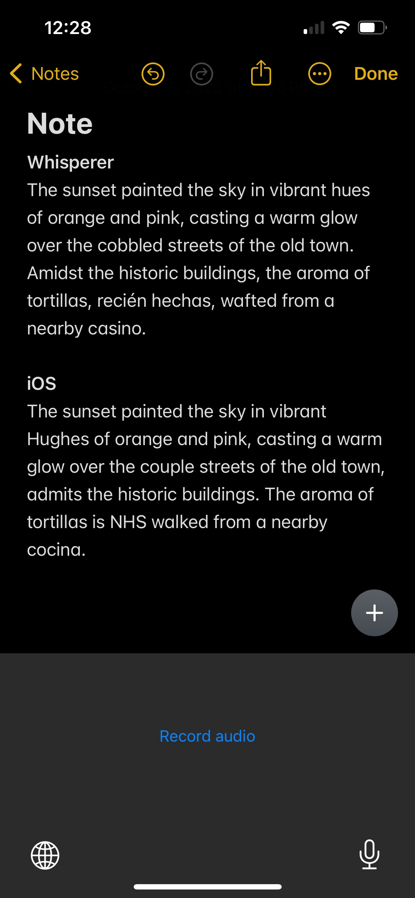

Experimental project created for personal use.

### Custom iOS keyboard using OpenAI Whisperer API for speech-to-text conversion

1. Captures audio from microphone
2. sends to OpenAI API for transcription
3. Inserts result into the active text edit 

### Example using in Notes, comparison with iOS built-in transcription 

